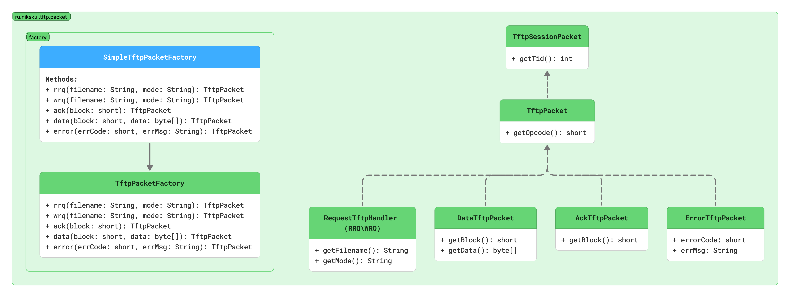
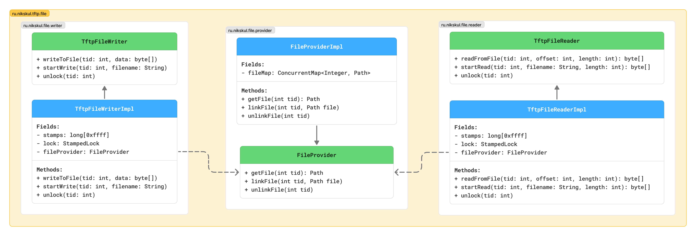

# TFTP (Trivial File Transfer Protocol)

[Source: RFC 1350](https://datatracker.ietf.org/doc/html/rfc1350)

## Definitions

TFTP is a simple protocol to transfer files, and therefore was named
the Trivial File Transfer Protocol or TFTP. It has been implemented
on top of the Internet User Datagram protocol (UDP or Datagram)
so it may be used to move files between machines on different
networks implementing UDP.

## Overview

- Any transfer begins with a request to read or write a file, which
  also serves to request a connection.
- If the server grants the
  request, the connection is opened and the file is sent in fixed
  length blocks of 512 bytes.
- Each data packet contains one block of
  data, and must be acknowledged by an acknowledgment packet before the
  next packet can be sent.
- A data packet of less than 512 bytes
  signals termination of a transfer.
- If a packet gets lost in the
  network, the intended recipient will timeout and may retransmit his
  last packet (which may be data or an acknowledgment), thus causing
  the sender of the lost packet to retransmit that lost packet.
- If a source TID does not match, the packet should be
  discarded as erroneously sent from somewhere else. An error packet
  should be sent to the source of the incorrect packet, while not
  disturbing the transfer.

## Clean Architecture

All system overview presented in the end. 

### Dependency Rule

Main idea of this project architecture is "Dependency Rule".

*Dependency Rule - Dependency must point into the deep.*

### Architecture overview

#### Domain model

Architecture core of this project is TFTP packet.

#### Interact with files

#### API

Application work as 2-in-1 Client-Server implementation.
- Server side is simple socket that work while application alive 
  and just delegate work over sessions.
- Client side provide API for send initial connection TFTP packets (RRQ\WRQ).
  And used by simple CLI interface.

#### Use cases

### Architecture

